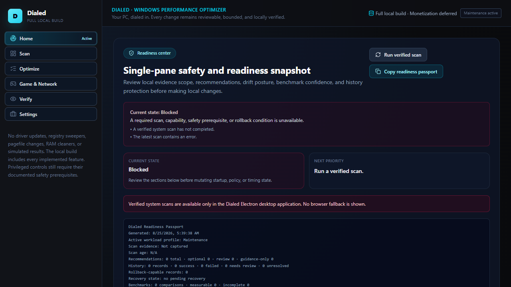

# Dialed

**Your PC, dialed in.** Dialed is the Windows performance optimizer that shows exactly what it found, what it changed, and whether the result was measurable. It is local-first and built around observed telemetry, explicit actions, post-action verification, and deterministic rollback where supported.



The source is tracked directly in this repository so changes can be reviewed, tested, and contributed to normally.

## Public flow

- **Home:** a discrete Ready, Review, or Blocked state, this-PC facts, up to three prioritized next actions, changes that can still be undone, and any tests in progress.
- **Tweaks:** every per-setting optimization on one page, grouped into Power, Startup & background, Windows & privacy, Input, Graphics, Experiments, and Maintenance, with a search box that jumps straight to a matching card. Each card shows its current state, what it changes, when it helps, when to leave it alone, and one action. Cards never change anything themselves — every change still goes through preview, confirmation, and verification, and a changed setting shows an accent border with an Undo button. A setting changed by something other than Dialed reads as "Set outside Dialed", with the option to test it or return it to the Windows default. Experiments (dynamic tick, platform clock source, CPU minimum state, global timer resolution) are marked distinctly and route into "Test a change."
- **Games:** per-game display setup and versioned, hash-verified backup/restore for game configuration files you explicitly select, plus source-linked graphics profiles for supported titles. Dialed does not silently rewrite game settings.
- **GPU:** hardware-accelerated GPU scheduling, multiplane overlay (MPO), fullscreen and windowed-game optimizations, and per-program graphics-processor preference. The machine-wide settings need Dialed running as administrator and a restart; every change is confirmed, checked afterward, and can be undone.
- **Measure:** a guided "Test a change" flow that applies a tweak (or records a manual change), captures before/after frame data with pinned native PresentMon, and compares runs with a warm-up discard, a noise-floor check, a capped-game warning, and a condition check for temperature/clock drift between runs. Also includes a canceled-by-default network-quality test and saved recordings & results.
- **Input devices:** read-only USB connection inventory and, on eligible High-Speed and Full-Speed devices, an optional polling-rate workflow built on the credited open-source [HIDUSBF](https://github.com/LordOfMice/hidusbf) filter driver, plus an input-delivery check. Dialed never changes Windows security features such as Memory Integrity.
- **Restore:** local audit history for every supported change, one-click undo with exact prior-state restoration, drift detection for changes made outside Dialed, and read-only readiness checks — all on one page.
- **Settings:** two built-in themes (Console and Instrument), exact running-version/signature status, and a verified user-initiated updater.

## Safe feature set

- Native Windows system, storage, startup, and temporary-file telemetry, plus versioned GPU, board, power, gaming, page-file, storage-health, network, and security diagnostics with explicit unavailable states.
- Searchable read-only installed-application inventory, and one-at-a-time removal for nine exact current-user optional-app families. It never performs all-user/provisioned debloat.
- [Hardware-matched BIOS guidance](docs/BIOS_GUIDANCE.md) showing only what Windows itself can observe, with source-backed manual recommendations and a portable checklist — no claim of reading or changing actual BIOS settings, and no automatic firmware changes.
- Current-user and machine-scope startup management with exact Registry-value rollback.
- Background apps: reversible Windows EcoQoS on one selected non-system process. It is not an FPS boost and must not be applied to games or launchers.
- A fixed table of single-purpose, reversible Windows settings — Game Mode, Game Bar background recording, hardware-accelerated GPU scheduling, MPO, global timer resolution, mouse acceleration, windowed/fullscreen game optimizations, and Windows-policy controls (background apps, driver-update exclusion, no-auto-restart) — most read from a documented Registry location and undoable to its exact prior value; USB selective suspend is read and set on the active power plan instead. The policy controls are edition-checked before they can be enabled, and a policy left set by something else on an edition that ignores it can be removed as a leftover.
- "Set outside Dialed": a setting another tool or administrator changed from the Windows default, with no matching change in Dialed's own history, is flagged on its card with a "Test it" option and a "Return to Windows default" action.
- The Ultimate Performance power plan (added, never activated) and CPU minimum-state 100% (AC only), both with exact rollback.
- A "Test a change" flow that applies or reverts a tweak itself, or accepts a manual change you confirm, then compares recordings with a warm-up discard, noise-floor threshold, capped-game detection, and a temperature/clock condition check.
- Pinned official Intel PresentMon capture with exact binary/license provenance, fixed-length visible-process sessions, local raw evidence, and comparison. It does not inject, auto-elevate, simulate input, or claim to measure click-to-screen latency.
- Previewed JSON/CSV benchmark evidence import with raw samples, strict condition matching, variance-aware comparison, and no synthetic score.
- Reviewed game discovery plus versioned, hash-verified backup and guarded restore for files you explicitly select, and source-linked per-game graphics profiles.
- Read-only USB input-device inventory, with an optional polling-rate workflow on eligible devices built on the open-source HIDUSBF driver. Dialed does not touch Memory Integrity or other Windows security features.
- A canceled-by-default network-quality test with a fixed HTTPS endpoint, bounded request sizes, private-address refusal, and local summary history. It never changes DNS, routes, QoS, adapters, firewall rules, or the Registry.
- Local audit history for every supported configuration change, exact one-click undo, and crash reconciliation for interrupted actions without blind retries. On an elevated launch, the change log moves into an administrator/SYSTEM-only folder, so a non-elevated process cannot forge an entry the elevated app would later act on.
- A previewed, field-redacted support-file export of the audit history and benchmark comparisons — no device identifiers, filenames, paths, process names, button input, or error logs — saved to disk and never sent automatically.
- Drift detection for changes made outside Dialed, and read-only readiness checks.
- Grounded local diagnostics only. External-AI audits are parked and are not part of the shipped runtime.
- A fail-closed updater with a pinned HTTPS feed, signed metadata, no redirects, exact byte/hash verification, pinned Authenticode publisher checks, no downgrade, and an explicit installer launch. Release trust is intentionally unconfigured until the final signing identity and channel are approved.

Dialed intentionally does not provide registry cleaners, generic driver updaters, RAM flushers, process termination, forced service disabling, or destructive debloat scripts. It never applies a global NVIDIA driver profile, GPU clock offsets or power-limit raises, an "estimated FPS gain" figure, or TCP/DNS changes sold as latency fixes.

The current source is version `2.8.0`, tracked entirely in this repository.

## Status

Monetization and commerce (checkout, entitlements, licensing) have been moved out of the shipped app into `parked/monetization` while the feature set is established; the current build has no checkout UI. Planning notes for a future release are kept for reference:

- [Distribution and landing-page copy kit](docs/DISTRIBUTION_LANDING_MARKETING_KIT.md)
- [Support, returns, and terms draft](docs/SUPPORT_RETURNS_AND_TERMS.md)
- [Monetization and distribution strategy](docs/MONETIZATION_DISTRIBUTION_STRATEGY.md)

See the [architecture and safety model](docs/ARCHITECTURE.md), [security policy](SECURITY.md), [contributor guide](CONTRIBUTING.md), and [roadmap](ROADMAP.md).
The owner/release trust setup is documented separately in
[Verified updates](docs/VERIFIED_UPDATES.md), and the remaining signing, installer, Electron-fuses, and hardware-matrix steps are tracked in the
[release packaging checklist](docs/RELEASE_PACKAGING_CHECKLIST.md).

## Build

```powershell
bun install --frozen-lockfile
bun test
bun run lint
bun run test:ui:fixtures
bun run electron:build
```

Windows builds request administrator access at launch through the normal UAC prompt, including the portable launcher. Users do not need to change compatibility settings. Action confirmation, target validation, and rollback checks still apply; administrator access does not replace signed driver setup verification. Native actions and evidence remain local.

## Development

```powershell
bun test
bun run build
bun run electron:dev
```

Current implementation status and limitations are recorded in [Project handoff](PROJECT_HANDOFF.md) and [Verification](VERIFICATION.md). The no-VM test model is in [Owner acceptance test](docs/OWNER_ACCEPTANCE_TEST.md).

## License

Dialed is licensed under the [MIT License](LICENSE).
