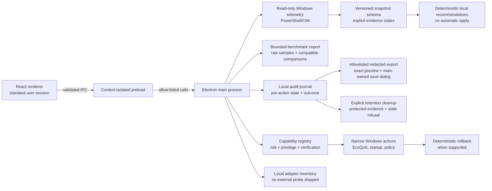

# Architecture and safety model

Dialed is designed as a transparent Windows maintenance utility. It favors measured telemetry and narrow, native Windows controls over broad “optimization” scripts.

## Trust boundaries

### Renderer and native actions

The renderer does not receive Node.js access. It calls a minimal, context-isolated preload bridge. Packaged content loads from `file:` rather than a fixed localhost service. The main process validates action identifiers, serializes mutations, and obtains current system state again before applying a change.

### Background apps

The process inventory is limited to the current user session. Protected Windows processes are excluded by name before an action is offered. A selected process must still have the same name and process ID at execution time. Dialed uses the Windows execution-speed EcoQoS setting; it does not terminate, suspend, reprioritize, or pin processes to CPU cores.

### Startup management

Only current-user `HKCU\Software\Microsoft\Windows\CurrentVersion\Run` string values are mutable. Machine-wide entries, scheduled tasks, unknown Registry kinds, and missing captured values are read-only. The exact Registry value is stored before removal so a supported rollback can recreate it.

### Safe OS policy

The consumer-content action writes only the documented `DisableWindowsConsumerFeatures` DWORD under the Windows policy path. Before it applies, Dialed requests a System Restore checkpoint. If that request fails, the policy write is not attempted. The previous policy state is retained for deterministic rollback.

### Audit journal

Each supported mutable action starts as a local `PENDING` journal entry containing its pre-action state. The final entry records verified success or failure, Windows output, and whether rollback remains available. Rollback is refused if the original target is missing, unsupported, changed, or no longer safely identifiable. On launch, pending entries are reconciled against current state and are never retried blindly.

Local export and retention remain inside the main-process boundary. Export uses an allowlisted schema, exact renderer preview, a main-owned save dialog, a journal fingerprint, and new-file-only atomic creation. Retention uses an explicit preview token and atomic journal rewrite. Unresolved, invalid/unclassified, or rollback-capable evidence is never eligible for deletion. History deletion is never described as rollback and never changes Windows configuration.

### Diagnostics and recommendations

The main process creates `SystemScanSnapshot` schema `1.1.0`. Expanded diagnostic fields use tagged availability records so permission failures or unsupported providers cannot appear as false or zero. Schema `1.0.0` snapshots can be migrated additively for validation, but migrated diagnostic fields remain `UNKNOWN` until a fresh scan.

The recommendation engine runs locally in the main process. Fixed rules cite snapshot paths and copy risk, rollback, and verification information from the capability registry. The renderer displays a reviewable collection; it cannot turn a guidance item into an action or apply a collection automatically.

### Benchmark evidence

The main process owns JSON/CSV file selection, parsing, preview tokens, bounded atomic storage, and deletion fingerprints. Imported records retain named tool/version, exact samples, variants, and required conditions. Comparisons require compatible metadata and conditions, expose raw statistics, and classify high variance or noise-sized changes conservatively. No tool is launched, no score is synthesized, and regression rollback remains review-only through verified Local Audit History evidence.

## Non-goals

- Registry cleaning or sweeping.
- RAM cleaners, memory flushers, pagefile changes, or fabricated performance scores.
- Driver downloading or installation.
- Core service disabling, Windows Update/Defender interference, or removal of system packages.
- Silent configuration changes and irreversible one-click “debloat” routines.

## Parked AI and bounded external paths

External-AI audit behavior is not part of the shipped runtime. Product diagnostics and recommendations remain local and deterministic. Historical redaction code is not evidence of a live provider feature.

The network surface keeps structured local adapter evidence separate from an
explicit external sample. The sample has a main-owned Cloudflare URL, pinned
public DNS resolution, fixed request/byte/time limits, consent, cancellation and
bounded local summary history. It reports scoped idle/loaded latency and small
throughput samples without inferring game routing, DNS quality, rated line speed,
packet loss or a Windows tuning recommendation.

The updater is also explicit and main-owned. A packaged timestamp-signed Dialed
binary must match the pinned publisher before it can read one build-time HTTPS
feed. An Ed25519-signed manifest fixes the version, installer URL, bytes, SHA-256
and publisher; the downloaded installer is revalidated immediately before a
separate explicit launch. Missing release trust disables the workflow.

## Privilege boundary

New Windows application executables use `requireAdministrator`, and the portable launcher uses `admin`, so opening them requests ordinary UAC elevation without manual compatibility settings. This applies when rebuilt; development launches and preserved binaries retain their existing execution level. Each machine-wide action still checks privilege and its own confirmation/target/rollback rules. Native input setup separately verifies signed policy and both executable identities. A general command bridge is prohibited.

### Runtime capability profile

`package.json` supplies the packaged default `public` profile and the Electron main process resolves it through the capability registry. A development-only environment override is ignored when `app.isPackaged` is true. The main process exposes only `{ profile, capabilities }` for the resolved profile, enforces the same capability decision at each IPC handler, and filters unavailable rollback affordances from journal data returned to the renderer. Consumer Premium inherits the conservative public capabilities before adding its own gated controls. The renderer constructs six grouped public areas from those records and falls back to Home when a stale selection is no longer available; it never supplies a profile value.
