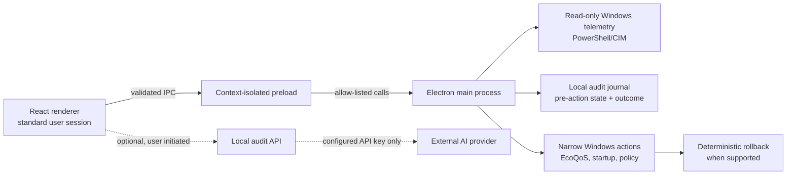

# Architecture and safety model

PC-Opti is designed as a transparent Windows maintenance utility. It favors measured telemetry and narrow, native Windows controls over broad “optimization” scripts.

## Trust boundaries

### Renderer and native actions

The renderer does not receive Node.js access. It calls a minimal, context-isolated preload bridge. The main process validates action identifiers and obtains current system state again before applying a change.

### Dynamic Eco-Balance

The process inventory is limited to the current user session. Protected Windows processes are excluded by name before an action is offered. A selected process must still have the same name and process ID at execution time. PC-Opti uses the Windows execution-speed EcoQoS setting; it does not terminate, suspend, reprioritize, or pin processes to CPU cores.

### Startup management

Only current-user `HKCU\Software\Microsoft\Windows\CurrentVersion\Run` string values are mutable. Machine-wide entries, scheduled tasks, unknown Registry kinds, and missing captured values are read-only. The exact Registry value is stored before removal so a supported rollback can recreate it.

### Safe OS policy

The consumer-content action writes only the documented `DisableWindowsConsumerFeatures` DWORD under the Windows policy path. Before it applies, PC-Opti requests a System Restore checkpoint. If that request fails, the policy write is not attempted. The previous policy state is retained for deterministic rollback.

### Audit journal

Each supported mutable action starts as a local `PENDING` journal entry containing its pre-action state. The final entry records success or failure, Windows output, and whether rollback remains available. Rollback is refused if the original target is missing, unsupported, or no longer safely identifiable.

## Non-goals

- Registry cleaning or sweeping.
- RAM cleaners, memory flushers, pagefile changes, or fabricated performance scores.
- Driver downloading or installation.
- Core service disabling, Windows Update/Defender interference, or removal of system packages.
- Silent configuration changes and irreversible one-click “debloat” routines.

## Optional AI audit

The AI audit is not telemetry and does not execute system actions. It receives a captured scan snapshot only after the user requests it. The local API rejects malformed snapshots and the prompt restricts recommendations to observed, safe maintenance options. It is unavailable without a configured API key.
