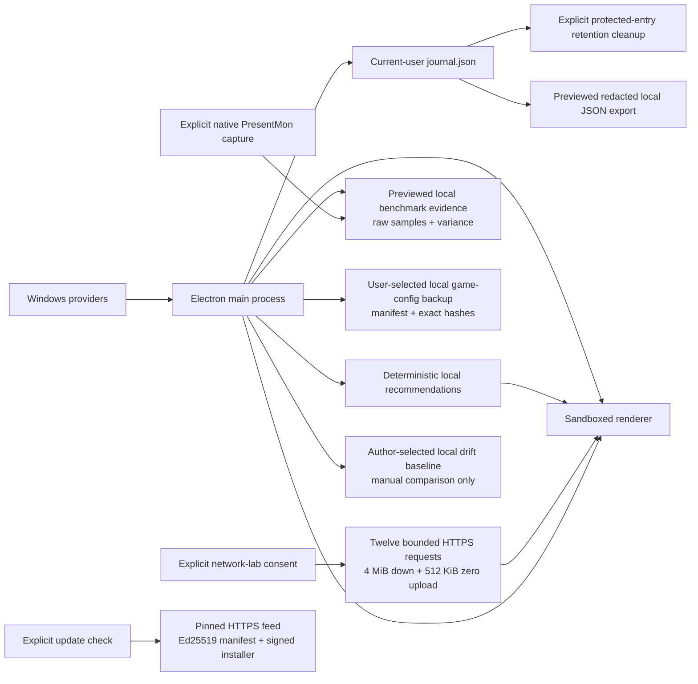

# Privacy and data flow

## Default local operation

Native scans, capability evaluation, system actions, and `journal.json` remain on the PC. Dialed has no background telemetry, account, advertising identifier, cloud sync, or analytics pipeline.

`journal.json` is stored in Electron's current-user application-data directory. It can contain selected process names, Registry value commands, action output, timestamps, and error text. The app does not upload it.

## Local history export and retention

Redacted export is user-initiated and local. Dialed displays the exact JSON and omitted-field list first, then the Electron main process opens a save dialog. The renderer never supplies a file path. Export creates a new `.json` file atomically and refuses overwrite or a journal that changed after preview.

The export allowlist retains coarse action family, known capability/category, status, timestamps, exit-code presence, rollback state, and reconciliation classification. It excludes journal IDs, action-specific identifiers, titles, process/startup names, Registry targets and commands, paths and drive targets, pre/resulting state, raw stdout/stderr, and reconciliation messages. Unknown or corrupt enum-like fields become `null`, `UNKNOWN`, or `Unclassified` rather than flowing into the export.

Retention cleanup is an explicit one-time local action, not background deletion and not rollback. The user previews completed entries older than 30 or 90 days, or all eligible completed entries. `PENDING`, `NEEDS_REVIEW`, invalid/unclassified, and rollback-available entries are always protected. A journal fingerprint prevents deletion after stale preview. Deleted history is not recoverable through Dialed and no Windows configuration is changed.

## Selected-device input check

An explicit eight-second foreground check reads only the selected device's Raw
Input payload after matching its HID collection identity. It reads mouse movement,
button/wheel flags, keyboard transitions, and supported HID buttons/axes/hats.
Keyboard scan identity (or a virtual-key fallback) is used transiently to suppress
autorepeat and distinguish simultaneous keys. Key identities, raw reports and
control values are never serialized, saved, exported or uploaded. The process
retains them only for the bounded check. Cancellation, focus loss, removal and
changed device membership discard the result.

Only non-keyboard message/motion timings, received-report totals and aggregate change/coverage
counts return to the app. Results are transient UI state, not input recording or
background monitoring. A shared receiver may expose several controls through one
physical USB identity; the app discloses this limitation. The signed September 13
input-review app predates this source implementation and remains header-only.
Keyboard channels return counts and an overall span only; individual message/key
timestamps do not cross the capture-process boundary. No calibration export has
been added. The separate overhead harness exports controller-only performance
aggregates only when an owner-authorized run is explicitly invoked; it does not ship.

## Local benchmark evidence

Imported benchmark JSON/CSV is selected by a main-process file dialog, previewed, and stored in bounded atomic `benchmarks.json` under current-user application data. It may contain workload/tool names, timestamps, user-authored conditions/notes, raw samples, and an optional local audit-entry link. It is never uploaded. Experiment deletion requires a main-process preview token and unchanged store fingerprint.

Native PresentMon capture is separately user-initiated. Dialed lists only visible,
non-protected processes, then records one fixed 10/20/30-second session with the
pinned Intel-signed PresentMon 2.5.1 binary. Raw CSV, target process name/PID/window
title, tool provenance, hashes and a bounded manifest remain under the current
user-data directory. A previewed deletion can permanently remove one raw capture;
imported benchmark comparisons are separate. Dialed does not upload captures,
record input, inject into a process, or run capture in the background.

## Game discovery and configuration backup

Installed-game discovery reads standard Windows installed-application metadata and bounded local configuration-path hints. It does not upload the inventory. Game-configuration backup is user-initiated through a main-process file dialog and accepts only bounded, regular configuration files. The selected files are copied exactly into a local backup directory with source paths, sizes, and SHA-256 hashes in a versioned manifest. Those paths can identify the Windows user or game installation and should be reviewed before sharing a backup.

Restore remains local. It requires a main-process preview token, rechecks current target state, creates local recovery copies before overwrite, and verifies restored hashes. Dialed does not silently scan arbitrary folders or automatically upload, edit, or restore game files.

## Opt-in network-quality sample

The network lab runs only after explicit per-run consent. It contacts the fixed
Cloudflare speed endpoint with five idle no-payload requests, one bounded 4 MiB
download accompanied by five loaded-latency requests, and one 512 KiB upload made
only of zero bytes. It does not accept a renderer-supplied URL, retain response
bodies/IP addresses, change network configuration, or run in the background.
Cloudflare receives the public IP and ordinary HTTPS metadata. Dialed stores at
most 20 local summaries containing timestamp, result state, endpoint id and
summary metrics. This is not rated line speed, game-server measurement, route/DNS
diagnosis, packet-loss proof, or evidence that a Windows tweak would help.

## Verified update workflow

There is no background update traffic. The Settings check button is unavailable
until a packaged, timestamp-signed Dialed build contains the approved feed,
Ed25519 public manifest key, allowed installer hosts and exact Authenticode
publisher identity. A user-initiated check contacts only the pinned HTTPS feed
after public-address validation. A selected installer is stored under the local
user-data update directory with its version, filename, size, SHA-256 and
certificate/timestamp verification record. No machine inventory, journal,
benchmark or game data is sent. Installer launch is a separate explicit action.

## Scan snapshot

The local `SystemScanSnapshot` currently contains:

- a SHA-256 device hash derived from the Windows machine GUID or hostname fallback;
- OS, CPU, memory, storage, startup, and temporary-file observations;
- GPU name/driver/status, motherboard make/product without serial numbers, active power scheme, HAGS and Game DVR state, page-file state, storage-provider health, physical adapter link state without IP/MAC data or external probing, and Secure Boot/TPM/virtualization state;
- elevation state, timings, and component error messages.

The local snapshot can therefore be machine-specific. It must not be attached to an issue without review and redaction.

## Local drift baseline

The author can explicitly save the latest verified scan as `drift-baseline.json` under current-user application data. The baseline contains an allowlist of stable configuration observations and the local device hash used only to refuse comparison with another machine. It excludes volatile memory load and free bytes, storage free space, temporary-file counts, page-file usage, scan timing and errors, and network link status/speed. A comparison reads Windows state but does not change it, runs only after an ordinary user-initiated scan, and has no scheduler or background cadence.

## Data-flow diagram

## Open privacy work

- Review any future external-data feature field by field before adding it to the runtime. The v0.1 application has no scan, journal, recommendation, or benchmark upload path.
