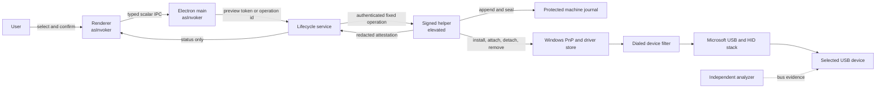

# Dialed native input stack threat model

Scope: the proposed `native/dialed-input-filter/` driver/helper boundary and its
integration with the existing Electron lifecycle. This is a source-backed Phase
0/1 model, not a vulnerability report. An isolated transparent-filter source
prototype now exists; no compiled driver, helper, package or live deployment
exists.

Snapshot: authoritative repository
`E:\CodexProjects\pc-optimizer\github-pc-opti`, Git HEAD `e567e1e` plus the
intentional dirty working tree inspected on 2026-09-01.

## Overview

Dialed is an `asInvoker` Electron app. Its existing main-process lifecycle is
production-disabled and accepts only scalar device digests, reviewed rates,
single-use preview tokens and opaque operation ids. The future design adds a
separately signed fixed-operation helper, an ACL-protected append-only machine
journal and a device-specific KMDF filter. The helper, not the renderer, owns all
native coordinates and privileged mutations.

| Component | Current or future role | Evidence |
| --- | --- | --- |
| Input Devices renderer | Selects one scanned device, requests typed previews, confirms one action and displays redacted status/recovery | `src/components/InputDevicesCenter.tsx:276-300`; `electron/preload.cjs:31-40` |
| Electron main | Validates scalar IPC, capability-gates every mutation route and serializes apply/reconcile | `electron/main.cjs:128-167` |
| Lifecycle service | Enforces immutable package gates, preview tokens, exact state, action ordering and durable `NEEDS_REVIEW` | `src/main/input-driver-lifecycle/index.cjs:602-775`, `782-854`, `971-1066` |
| Signed helper (future) | Revalidates package/target/security/inventory, performs fixed privileged operations and seals native state | Required by `docs/INPUT_DRIVER_LIFECYCLE.md`; not implemented |
| Protected machine journal (future) | Append-only complete preimages, operation chain, cross-process serialization and recovery | Native bindings listed at `src/main/input-driver-lifecycle/index.cjs:15-27`; production store absent |
| Dialed device filter | Offline transparent lower-filter source with no request queue or scheduling behavior; future supported scheduling remains gated | `phase1/ARCHITECTURE_DECISION.md`; `phase1/prototype-contract.json`; not compiled or deployed |
| Windows PnP/USB/HID stacks | Enforce device stack, signing, power and scheduling semantics | External platform boundary; exact feasibility unresolved |
| USB device/controller/analyzer | Untrusted descriptors/reports, physical topology and independent bus evidence | Device-capability schema and Phase 1 proposal |

### Effective resources and capabilities

| Deployment or workflow | Resource or capability | Configuration and precedence | Safe effective value or location | Readers, writers or recipients | Enforcing control | Evidence or unknowns |
| --- | --- | --- | --- | --- | --- | --- |
| Current packaged app | Driver lifecycle capability | Runtime profile plus `package.json` input-driver config | `UNCONFIGURED`; no manifest/payload/helper/store | Renderer can read unavailable status; no production writer | Main capability gate and static lifecycle gates | `package.json:74-88`; `src/main/input-driver-lifecycle/index.cjs:602-615` |
| Future package load | INF/SYS/CAT/helper payload | Package-relative manifest path and exact configured digest/publisher/permission pins | Under packaged resources; exact path not yet selected | Main/lifecycle reads; signed helper consumes after revalidation | Path containment, SHA-256, role/signature/publisher validation | `src/main/input-driver-lifecycle/index.cjs:619-637`; payload absent |
| Future privileged mutation | Local helper protocol | Fixed protocol and operation enum; renderer values are not native coordinates | Local authenticated endpoint, exact mechanism unresolved | Lifecycle client and signed helper only | Nonce, caller identity, one-time token and per-boundary revalidation required | Protocol not implemented; design requirement |
| Future recovery | Machine journal | Helper-attested identity pinned in app config | ACL-protected machine location chosen at implementation | Signed helper reads/appends; renderer receives opaque id/digest | Append-only journal, cross-process CAS, checkpoint chain and fsync | `src/main/input-driver-lifecycle/index.cjs:652-666`; production store absent |
| Future filter attachment | One exact USB HID interface scope | Exact digest + interface hardware ID + endpoint + complete present/non-present/phantom inventory + compatibility class | Extension INF `AddFilter`, lower position, no relative-order dependency | Signed helper/Windows PnP write; lifecycle observes | Exact-delta comparison and block on ambiguity/collateral scope | `phase1/ARCHITECTURE_DECISION.md`; `src/main/input-driver-lifecycle/index.cjs:669-685`, `762-775`; hardware ID unresolved |
| Phase 1 evidence | Selected endpoint capture | Approved device/controller/analyzer and immutable artifact hashes | Disposable lab evidence store; exact location TBD | Test operator and release reviewers | Independent endpoint identification, hashes and provenance | Not approved or run |

## Threat model, trust boundaries and assumptions

### Protected assets and objectives

- Integrity and availability of the selected and unrelated input devices.
- Windows bootability, PnP/power stability and enabled security protections.
- Exact package, publisher, driver/helper/app identities and supply-chain evidence.
- Correct physical-device selection, composite scope and supported-rate decision.
- Complete native preimages and the ability to detach/remove/recover after any
  interruption.
- Local device/topology privacy and non-disclosure of native coordinates to the
  renderer.
- Truthful separation of configuration, active session, Windows delivery, USB
  cadence and end-to-end latency claims.

Security objectives are: no generic privileged bridge; no mutation before a
reviewed exact preview; no stale/replayed authorization; no package/path/signature
substitution; no collateral device change; no unjournaled write; no silent partial
success; no automatic restart; and no security reduction to make the driver load.
These extend the repository policy requiring validated targets, rollback state,
pending audit evidence and readback for privileged operations (`SECURITY.md:17-24`).

### Actors and realistic starting capabilities

- A normal local user can select devices, request previews and cancel/approve UAC,
  but is not assumed to be an administrator or able to modify protected machine
  state.
- A compromised renderer can invoke exposed preload methods and control their
  scalar arguments, but must not gain arbitrary helper commands or native paths.
- A non-elevated local process can race ordinary user files and IPC, but is not
  assumed to control the signed helper, Windows driver store or protected journal.
- A malicious/buggy USB device controls descriptors, reports, reconnect timing and
  some identity fields, but not the trusted package or Dialed signing keys.
- A supply-chain attacker may substitute a package, certificate, update or build
  input unless exact hashes, catalog membership, publisher and provenance are
  independently enforced.
- An administrator already has broad host authority; ordinary owner-authorized
  admin behavior is not treated as a new privilege escalation, but mistaken scope
  and unrecoverable mutation remain safety/security failures.

### Trust boundaries and assumptions

1. Renderer to main: untrusted scalar IPC crosses into capability and schema
   validation (`electron/main.cjs:132-167`).
2. Main/lifecycle to helper: future privilege boundary; identity, nonce, replay,
   method and exact-plan binding are unresolved implementation requirements.
3. Helper to journal: future machine-state integrity boundary; ACL ownership,
   append semantics, crash durability and cross-process CAS require native proof.
4. Helper to Windows PnP/driver store: privileged package and attachment boundary;
   only exact semantic deltas are allowed.
5. Filter to Microsoft stack/device: kernel availability and untrusted I/O
   boundary; pass-through, buffer validation, cancellation and PnP/power correctness
   are safety critical.
6. Measurement to product claim: external evidence boundary; a Windows event count
   cannot be promoted into USB or latency proof.

Assumptions: the retail app and helper will have one controlled publisher identity;
the disposable test host is recoverable; and the analyzer can identify the selected
endpoint. Each is unverified. The former assumption that a general documented
host-side scheduling mechanism may exist did not survive the 2026-09-03 review;
only a firmware-published alternate setting or exact published vendor protocol
could reopen a per-device route. If that route or protected-signing assumption
fails, the affected live phase is blocked. The owner-supplied third-party driver
folder is explicitly excluded.

An owner-approved independent architecture review found the Phase 0 map coherent
but required machine enforcement of capability semantics and a PnP-only package
contract before Phase 1. Those repairs and the transparent source receive fresh
Windows-systems and QA review before this milestone closes.

## Attack surface, mitigations and attacker stories

All rows are hypotheses until validated against future implementation.

| Priority | Scenario and capability gain | Prerequisites | Impact | Existing controls | Required mitigation | Evidence |
| --- | --- | --- | --- | --- | --- | --- |
| Critical | Package/helper substitution crosses into signed kernel execution | Attacker can alter packaged resources, manifest resolution or trust evidence | Kernel code execution/persistent privileged compromise | Exact manifest/payload hashes and separate helper/package/app signature gates exist in lifecycle design | Reverify catalog membership, Authenticode chain/revocation/timestamp, exact publisher and bytes immediately before every install/upgrade; freeze release provenance | `src/main/input-driver-lifecycle/index.cjs:619-637`; manifest schema roles at `src/main/input-driver-lifecycle/driver-package-manifest.schema.json:115-203` |
| Critical | Generic or replayable helper IPC lets a compromised renderer perform arbitrary privileged actions | Helper exposes path/command/Registry/IOCTL input or accepts a stale token | Local privilege escalation or arbitrary system mutation | Current renderer/main IPC exposes only typed scalar actions and single-use previews | Authenticated local IPC, caller/publisher binding, nonce, expiry, one-time plan digest and fixed operation schemas; fuzz malformed/replayed messages | `electron/main.cjs:136-166`; `src/main/input-driver-lifecycle/index.cjs:752-757` |
| High | Wrong or ambiguous physical device is attached/changed | Spoofed/stale device identity, composite ambiguity or reconnect race | Loss of input, collateral device behavior, unsafe restart state | Helper-attested digest/rate/checkpoint and exact inventory are required; the offline target-binding contract now refuses over-broad identifiers, ambiguous composite scope, duplicate instance identities and cross-container scope | Derive digest from stable topology plus verified descriptors, re-enumerate at each boundary, block any ambiguity or topology drift | `src/main/input-driver-lifecycle/index.cjs:669-685`, `762-775` |
| High | Missing non-present/phantom attachment permits unsafe package removal | Incomplete inventory or helper/parser bug | Broken devices, orphaned filters, boot/input failure | Complete inventory and detach-before-remove are contract requirements | Enumerate all present/non-present/phantom scope under helper authority and require completeness attestation before maintenance | `src/main/input-driver-lifecycle/index.cjs:18-26`, `849-854` |
| High | Journal tamper, truncation or write reordering destroys exact recovery | Local race, crash/power loss or weak ACL/store | Irrecoverable partial install/filter state | Checkpoint identity/freshness/chain and durable `NEEDS_REVIEW` exist in lifecycle | Signed-helper-owned ACL directory, append-only fsync sequence, hash chain, cross-process CAS, startup reconciliation and offline recovery test | `src/main/input-driver-lifecycle/index.cjs:652-666`, `727-749` |
| High | Filter mishandles malformed descriptors, buffers, cancellation or completion | Malicious/buggy USB device or concurrency fault | Kernel crash/corruption or persistent device denial of service | Transparent source owns no queue, parses no request and relies on framework auto-forwarding | Any future request handler requires WDF-safe buffer APIs, integer/length validation, exactly-once completion, cancellation/rundown discipline, static analysis, fuzzing and Driver Verifier | `phase1/driver/dialed_input_filter.c`; scheduling handler absent |
| High | PnP/power/restart lifecycle deadlocks or fails to detach | Surprise removal, sleep/hibernate, fast startup or interrupted update | Boot/input unavailability or unrecoverable attachment | Explicit states block new work and require reconciliation | Test full PnP/power matrix on disposable hosts; default pass-through; safe uninstall/recovery independent of UI verification | `src/main/input-driver-lifecycle/index.cjs:32-61`, `727-749` |
| High | A scheduling technique secretly patches Microsoft code or requires disabled protections | No documented mechanism meets requested rate | Integrity/security regression and unsupported retail kernel behavior | Handoff hard stop and production `UNCONFIGURED` gate; the 2026-09-03 review confirmed no documented host-side schedule control exists, and the binding validator refuses any schedule request while that gate is blocked | Accept only documented interfaces with protections enabled; mark tier `BLOCKED` otherwise | `package.json:74-88`; `phase1/ADR-0002-DOCUMENTED-SCHEDULING-INTERFACE.md`; `target-binding-validator.cjs` |
| Medium | TOCTOU after successful preview changes package, security state, device or inventory | Local concurrent mutation between preview and helper call | Wrong target/package or false success | Current plan binds revision and helper revalidation is required | Revalidate exact state immediately before each native write and compare one allowed post-delta; serialize machine operations | `src/main/input-driver-lifecycle/index.cjs:767-775`, `971-1029` |
| Medium | External matching package is mistaken for Dialed ownership | Same package exists outside Dialed history | Unauthorized repair/upgrade/removal | Explicit adoption and external-package protection exist | Preserve ownership mode and allow only selected attachment management; never mutate external package automatically | `src/main/input-driver-lifecycle/index.cjs:741-746`, `801-810` |
| Medium | Evidence conflation creates an unsupported 8 kHz or latency claim | Config/readback or Raw Input data is available without bus/latency evidence | Consumer deception, unsafe compatibility promise | UI has five evidence levels and capability schema separates them | Require bus PASS for supported rate; require separate latency method; invalidate on material stack/firmware/method change | `src/components/InputDevicesCenter.tsx:270-275`; device-capability schema |
| Medium | Signed filter conflicts with anti-cheat or another filter stack | Specific game/security product and filter coexist | Blocked game, instability or account/support harm | No game test is part of Phase 1 | Later explicit compatibility matrix; fail closed and do not claim support while unresolved | Later owner/release gate |
| Low | Native device details leak through renderer-visible errors/status | Helper/main returns paths, ids, service names or journal content | Local privacy/inventory exposure and easier attack targeting | Public status is redacted and errors expose codes/messages only | Schema-test every public result/error; log sensitive details only in protected local evidence | `src/main/input-driver-lifecycle/index.cjs:692-717`; tests cover public redaction |

## Severity calibration

- **Critical:** a realistic failure grants non-admin code execution in the kernel
  or arbitrary privileged helper execution. A package substitution stopped by
  independently enforced exact hashes and valid publisher/catalog checks is not a
  confirmed Critical finding.
- **High:** kernel memory corruption, persistent boot/input loss, mutation of the
  wrong physical scope, unrecoverable partial state or a required Windows security
  reduction. A test-only crash on a disposable machine remains serious evidence
  but is not automatically a retail exploit.
- **Medium:** a constrained TOCTOU, local device/topology disclosure, recoverable
  denial of service, ownership confusion or materially unsupported product claim
  without demonstrated kernel code execution.
- **Low:** bounded diagnostic disclosure or usability/recovery friction with no
  privilege gain, collateral mutation or durable availability loss.

Missing implementation evidence affects confidence, not potential impact. The
model does not assume remote access, multi-tenancy, compromised signing keys or an
attacker who already has administrator control.
